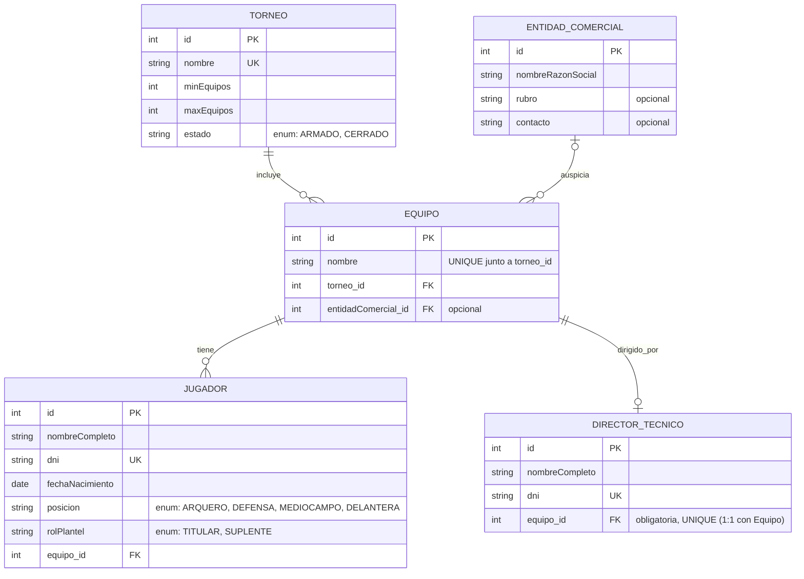

# Modelo de dominio: Gestión de torneos de fútbol 7

## Alcance

Este modelo cubre exclusivamente **inscripción y gestión de planteles** (Torneo, Equipo,
Jugador, Director Técnico, Entidad Comercial). Quedan fuera de alcance partidos, fixture,
resultados y tabla de posiciones — se considerarían una extensión posterior del sistema.

## Diagrama entidad-relación

## Entidades y atributos

### Torneo
| Atributo | Tipo | Restricción |
|---|---|---|
| id | int | PK |
| nombre | string | obligatorio, único global |
| minEquipos | int | obligatorio |
| maxEquipos | int | obligatorio |
| estado | enum {ARMADO, CERRADO} | obligatorio |

### Equipo
| Atributo | Tipo | Restricción |
|---|---|---|
| id | int | PK |
| nombre | string | obligatorio, único dentro del Torneo |
| torneo_id | FK → Torneo | obligatoria |
| entidadComercial_id | FK → EntidadComercial | opcional (nullable) |

### Jugador
| Atributo | Tipo | Restricción |
|---|---|---|
| id | int | PK |
| nombreCompleto | string | obligatorio |
| dni | string | obligatorio, único global |
| fechaNacimiento | date | obligatorio |
| posicion | enum {ARQUERO, DEFENSA, MEDIOCAMPO, DELANTERA} | obligatorio |
| rolPlantel | enum {TITULAR, SUPLENTE} | obligatorio |
| equipo_id | FK → Equipo | obligatoria (no existen jugadores libres) |

### DirectorTecnico
| Atributo | Tipo | Restricción |
|---|---|---|
| id | int | PK |
| nombreCompleto | string | obligatorio |
| dni | string | obligatorio, único global |
| equipo_id | FK → Equipo | obligatoria, única (relación 1:1 con Equipo) |

### EntidadComercial
| Atributo | Tipo | Restricción |
|---|---|---|
| id | int | PK |
| nombreRazonSocial | string | obligatorio |
| rubro | string | opcional |
| contacto | string | opcional |

## Relaciones y cardinalidades

| Relación | Cardinalidad | Implementación |
|---|---|---|
| Torneo — Equipo | 1 : N | `equipo.torneo_id` (obligatoria) |
| Equipo — Jugador | 1 : (0..10, con objetivo 7..10) | `jugador.equipo_id` (obligatoria) |
| Equipo — DirectorTecnico | 1 : (0..1, con objetivo 1) | `directorTecnico.equipo_id` (obligatoria, única) |
| EntidadComercial — Equipo | (0..1) : (0..N) | `equipo.entidadComercial_id` (opcional) |

## Reglas de negocio (invariantes de aplicación, no expresables como cardinalidad simple)

1. **Composición del plantel**: cada Equipo debe tener exactamente 7 Jugadores con
   `rolPlantel=TITULAR` y entre 0 y 3 con `rolPlantel=SUPLENTE`.
2. **Arquero obligatorio**: entre los TITULARES de un Equipo, exactamente 1 debe tener
   `posicion=ARQUERO`.
3. **Completitud diferida**: un Equipo puede estar incompleto (menos jugadores, sin DT)
   mientras `Torneo.estado=ARMADO`; las reglas 1 y 2 se validan recién al intentar cerrar
   el Torneo.
4. **Condición de cierre**: `Torneo` no puede pasar a `CERRADO` si (a) algún Equipo está
   incompleto, o (b) `count(Equipo) < Torneo.minEquipos`.
5. **Mutabilidad por estado**: mientras `Torneo.estado=ARMADO` se permite alta/baja/
   reasignación de Equipo, Jugador y DirectorTecnico; una vez `CERRADO`, la estructura es
   inmutable.
6. **Unicidad de nombre de Equipo**: única dentro de su Torneo, no globalmente.
7. **Unicidad de nombre de Torneo**: global.
8. **Fichaje sin historial**: `jugador.equipo_id` y `directorTecnico.equipo_id`
   representan el estado actual únicamente; no se registra historial de pases.
9. **Sin jugadores/DT libres**: tanto Jugador como DirectorTecnico se crean siempre
   asociados a un Equipo (FK obligatoria desde el alta).

## Fuera de alcance (identificado durante el modelado, no resuelto)

- Gestión de partidos, fixture, resultados y tabla de posiciones.
- Historial de fichajes entre temporadas/torneos.
- Posibilidad de que una misma persona sea Jugador y DirectorTecnico simultáneamente.
